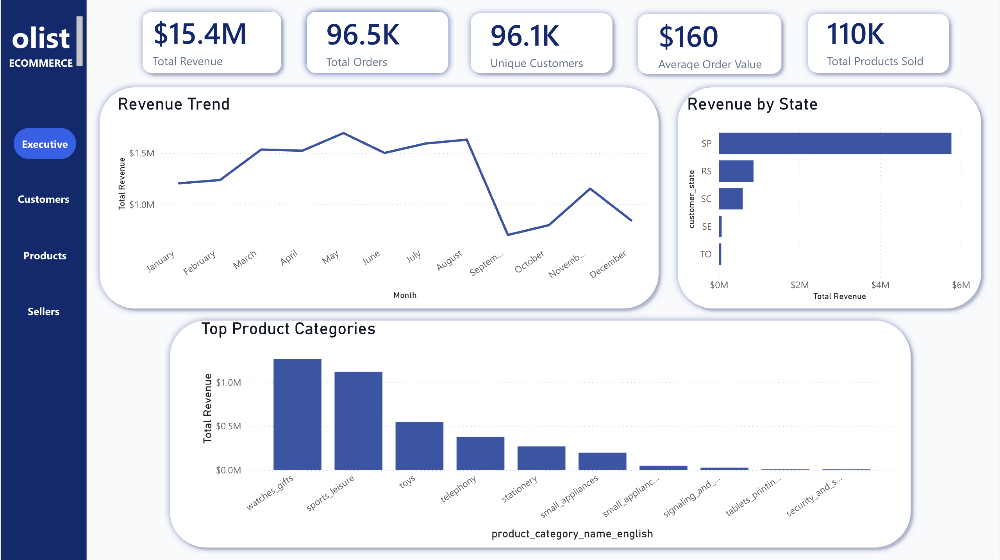
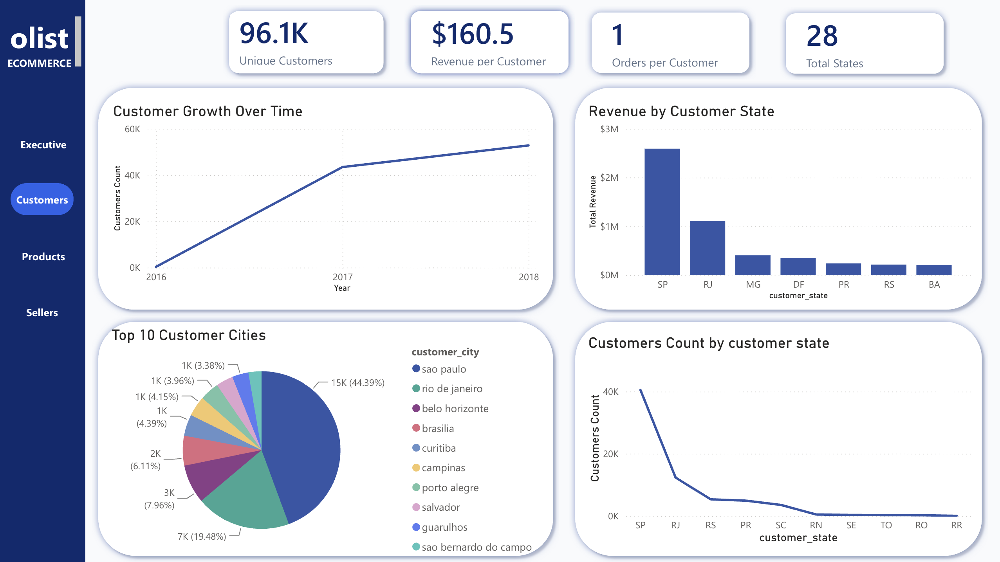
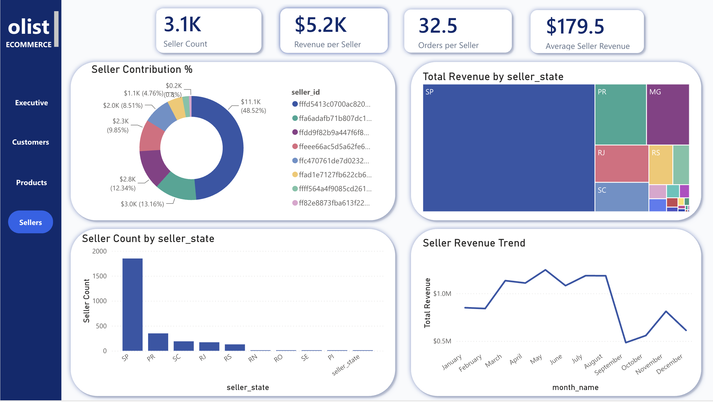
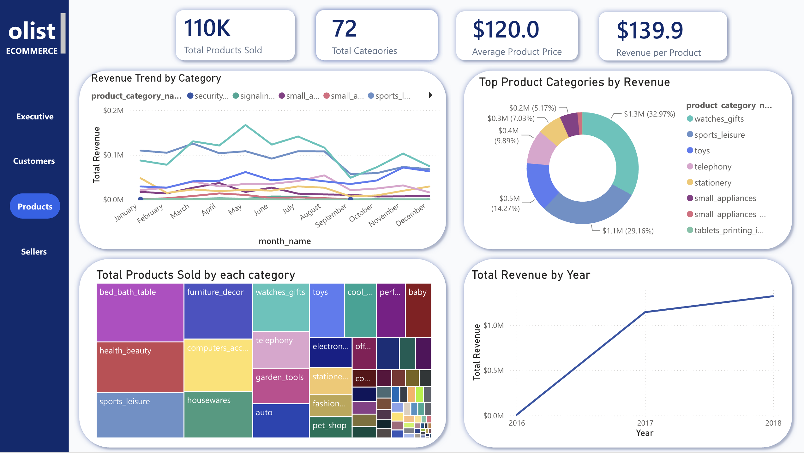

# Olist E-Commerce Data Warehouse

An end-to-end data engineering project that transforms raw Brazilian e-commerce data from the Olist public dataset into a structured PostgreSQL data warehouse with a star schema, automated ETL pipeline, and multi-page Power BI analytics dashboard.

---

## About the Dataset

The Olist dataset is a real Brazilian e-commerce public dataset containing 100,000+ orders placed between 2016 and 2018 across multiple marketplaces in Brazil. It covers order status, pricing, payment, freight, customer location, product attributes, and seller information.

---

## Architecture

```
Raw CSV Files (9 datasets)
        ↓
Python ETL — load_staging.py
        ↓
PostgreSQL Staging Layer
        ↓
Python ETL — build_dimensions.py
        ↓
Dimension Tables (Star Schema)
        ↓
Python ETL — build_fact.py
        ↓
Fact Table
        ↓
export_powerbi.py
        ↓
Power BI Dashboard (4 pages)
```

---

## Tech Stack

| Layer | Technology |
|---|---|
| Programming | Python 3.9 |
| Database | PostgreSQL 18 |
| ETL Libraries | pandas, SQLAlchemy, psycopg2 |
| Dataset | Olist Brazilian E-Commerce (Kaggle) |
| Visualization | Power BI Service |
| Version Control | Git & GitHub |

---

## Data Model (Star Schema)

### Dimension Tables
- `warehouse.dim_customer` — customer ID, city, state, region
- `warehouse.dim_seller` — seller ID, city, state
- `warehouse.dim_product` — product ID, category, name
- `warehouse.dim_date` — date key, year, month, quarter, day of week

### Fact Table
- `warehouse.fact_sales` — order revenue, freight value, quantity, payment value, review score — linked to all four dimension tables

---

## Pipeline Scripts

| Script | Purpose |
|---|---|
| `load_staging.py` | Loads all 9 raw CSVs into PostgreSQL staging schema |
| `build_dimensions.py` | Builds dim_customer, dim_seller, dim_product, dim_date |
| `build_fact.py` | Builds fact_sales from staging with all FK references |
| `export_powerbi.py` | Exports warehouse tables to CSV for Power BI |
| `etl_runner.py` | Orchestrates the full pipeline end to end |
| `db.py` | Database connection handler |
| `config.py` | Configuration and environment variables |

---

## Pipeline Steps

1. **Load Staging** — all 9 raw Olist CSV files loaded into `staging` schema as-is
2. **Build Dimensions** — clean and deduplicate customers, sellers, products, dates into dimension tables
3. **Build Fact** — join staging tables to produce `fact_sales` with foreign keys to all dimensions
4. **Export** — generate CSV files from warehouse tables for Power BI consumption
5. **Automate** — `etl_runner.py` orchestrates all steps in sequence

---

## Power BI Dashboard (4 Pages)

### Executive Overview
High-level KPIs — total revenue, total orders, average order value, overall review score

### Customer Analytics
Customer distribution by state, top cities by order volume, repeat customer analysis

### Seller Analytics
Top sellers by revenue, seller distribution by region, freight performance

### Product Analytics
Top product categories by revenue, average review score by category, order volume trends

---

## Dashboard Screenshots

### Executive Overview


### Customer Analytics


### Seller Analytics


### Product Analytics


---

## Project Structure

```
olist-ecommerce-data-warehouse/
│
├── data/                  ← Raw Olist CSV files
├── scripts/
│   ├── load_staging.py    ← Load CSVs into staging
│   ├── build_dimensions.py← Build dimension tables
│   ├── build_fact.py      ← Build fact table
│   ├── export_powerbi.py  ← Export CSVs for Power BI
│   ├── etl_runner.py      ← Pipeline orchestrator
│   ├── db.py              ← Database connection
│   └── config.py          ← Configuration
├── sql/                   ← Schema SQL files
├── notebooks/             ← Analysis notebooks
├── dashboards/            ← Power BI screenshots
├── README.md
└── requirements.txt
```

---

## How to Run

```bash
# Clone the repo
git clone https://github.com/sanda0620/olist-ecommerce-data-warehouse.git
cd olist-ecommerce-data-warehouse

# Create virtual environment
python3 -m venv venv
source venv/bin/activate
pip install -r requirements.txt

# Set up environment variables
cp .env.example .env
# Edit .env with your PostgreSQL credentials

# Run the full pipeline
python scripts/etl_runner.py
```

---

## Key Skills Demonstrated

- ETL pipeline design with modular Python scripts
- PostgreSQL data warehouse design (star schema)
- Dimensional modeling — fact and dimension tables
- Large dataset processing (100,000+ orders)
- Multi-page Power BI dashboard development
- Data cleaning and transformation with pandas
- Git version control and GitHub project management